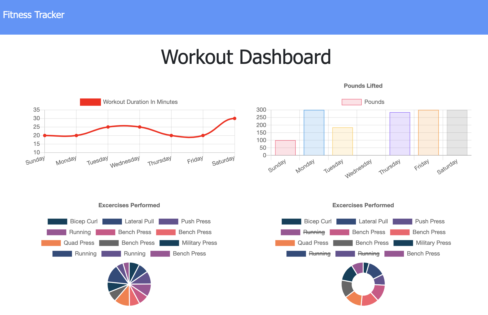
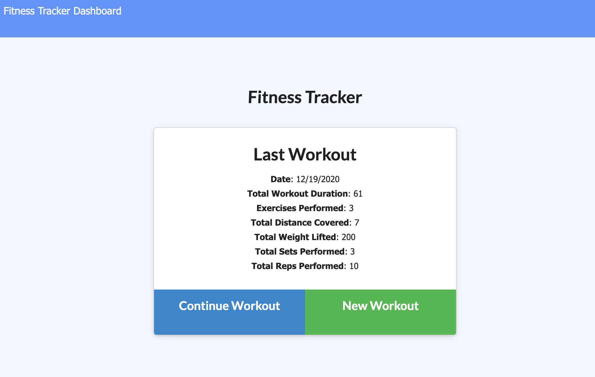

# Fitness Tracker

## Descripttion 
As a user, I want to be able to view create and track daily workouts. I want to be able to log multiple exercises in a workout on a given day. I should also be able to track the name, type, weight, sets, reps, and duration of exercise. If the exercise is a cardio exercise, I should be able to track my distance traveled.

## Table of Contents
1. [Installation Instructions](#installation)
2. [Usage](#usage)
3. [Contributing to this Application](#contributing)
4. [How to test](#how-to-test)
5. [License](#license)
6. [Questions](#questions)

## Installation
This application is deployed on Heroku and does not require any installation for use.

## Usage
The user can use this application to keep track of their daily works to reach their fitness goals more quickly.

Fitness Tracker Week Overview

Fitness Tracker Latest Workout

## Acceptance Criteria

When the user loads the page, they should be given the option to create a new workout or continue with their last workout.

The user should be able to:

  * Add exercises to a previous workout plan.

  * Add new exercises to a new workout plan.

  * View the combined weight of multiple exercises on the `stats` page.

## Contributing
None

## How to Test
None

# Questions
Have questions? Contact the developer at: 
* GitHub Username: giocordova20
* Email: giocordova@gmail.com
